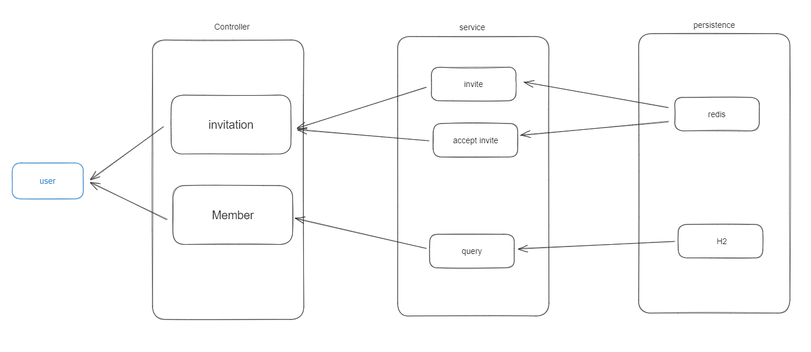

## 개요 
회원 초대 링크 생성 프로젝트 

## 초대 
### 초대 코드 생성 
   - [ ] ID를 이용해 DB에 존재 하는 지 확인
     - EXCEPTION: 
       - 이미 생성된 ID가 존재 할 경우
   - [ ] MEMBER(ID, EMAIL, PHONE_NUM, STATUS(0)) 객체를 DB에 임시 저장 
   - [ ] 초대 코드 생성 후 REDIS에 저장
     - K-V <초대 코드:ID> 
     - TTL 설정 

### 초대 코드 승인
   - [ ] CODE를 이용해 REDIS 조회 
     - EXCETPTION
       - 초대 코드가 존재 하지 않을 경우
   - [ ] ID를 이용해 DB (ID, STATUS(1)) 객체 업데이트  
   - [ ] 해당 초대 코드를 REDIS에서 삭제


### 그룹(워크스페이스) 초대 API

POST `/invite`

**Request Body**

```
{
  "inviteGroupId" : 0,
  "inviteMemberName": "String",
  "inviteMemberPhoneNumber": "String",
  "inviteMemberEmail": "String"
}
```

**Response Body**
```
{
  "inviteCode" : 0 
}
```

### 초대 승낙 API

GET `/accept/{code}`

**Response Body**

```
{
  "msg" : "초대가 성공적으로 완료되었습니다."
}
```

---

## 아키텍처 


